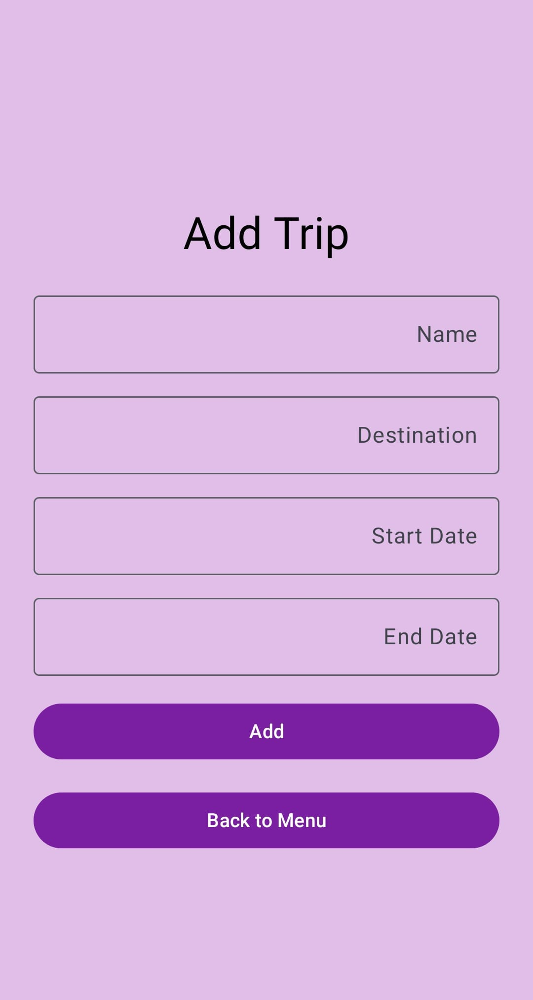
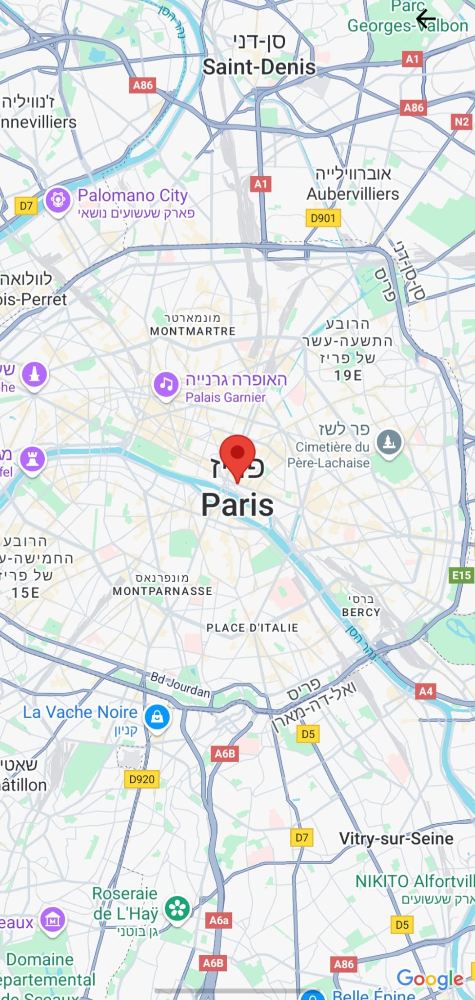
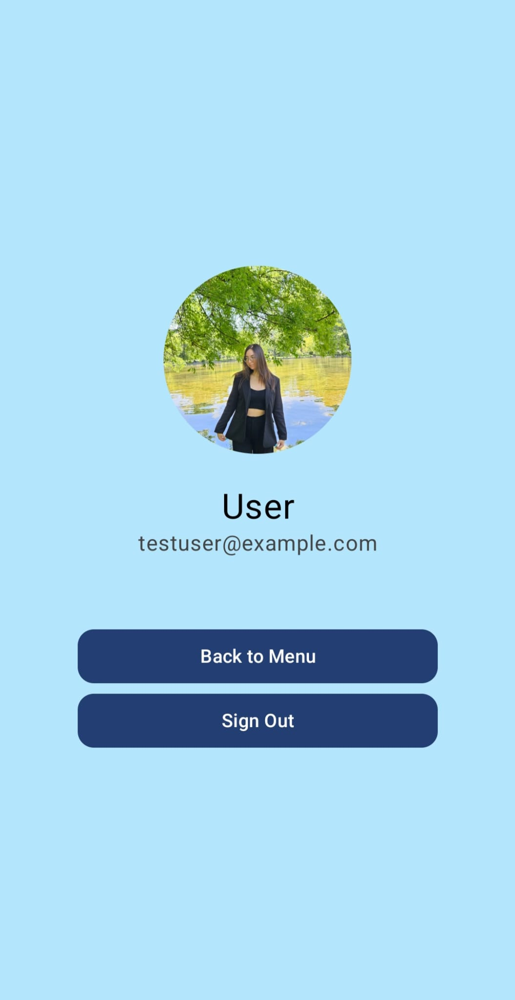
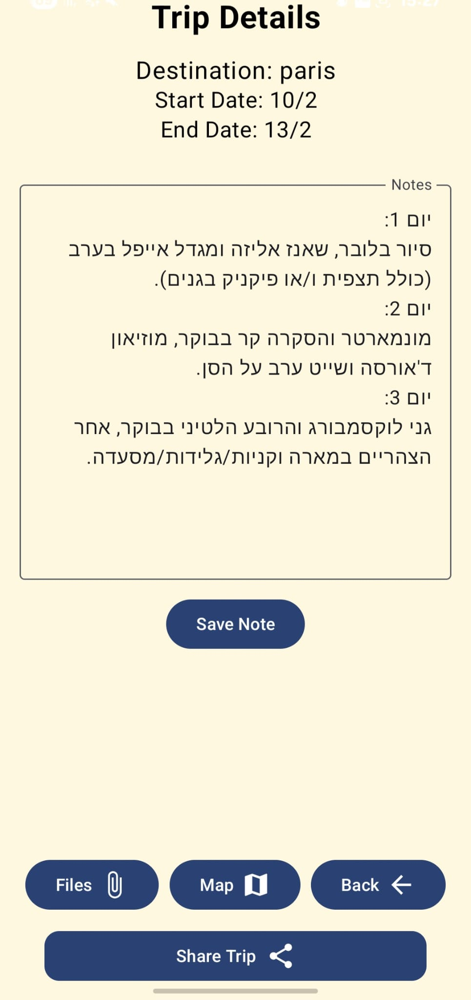
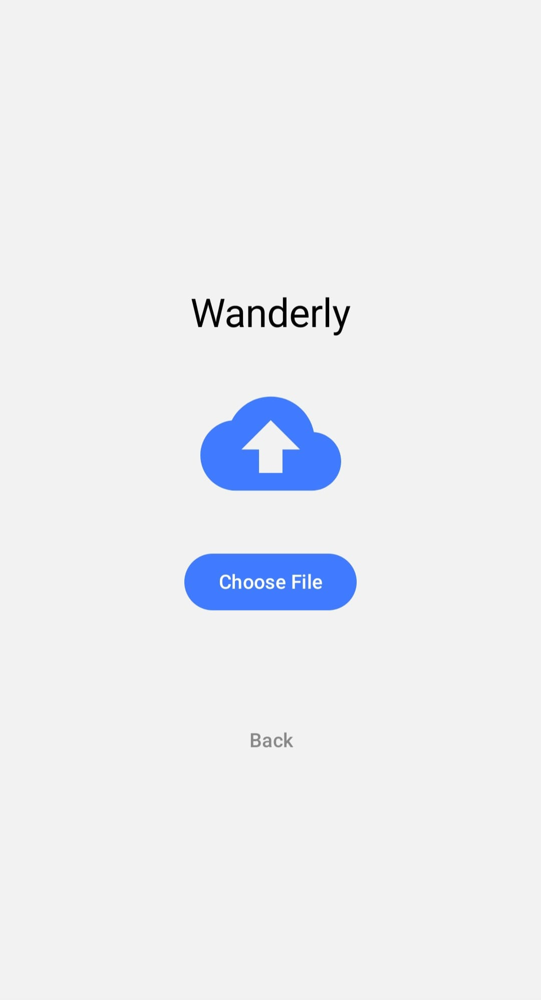
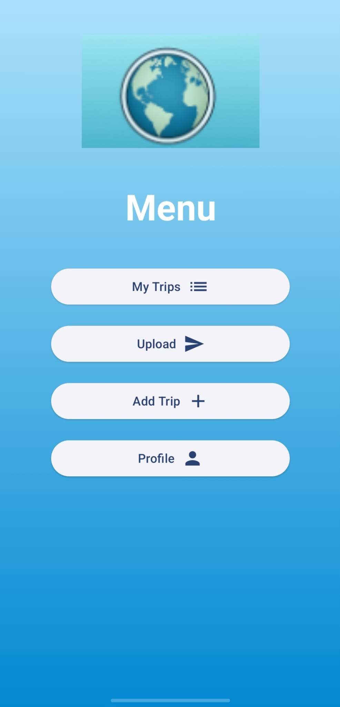
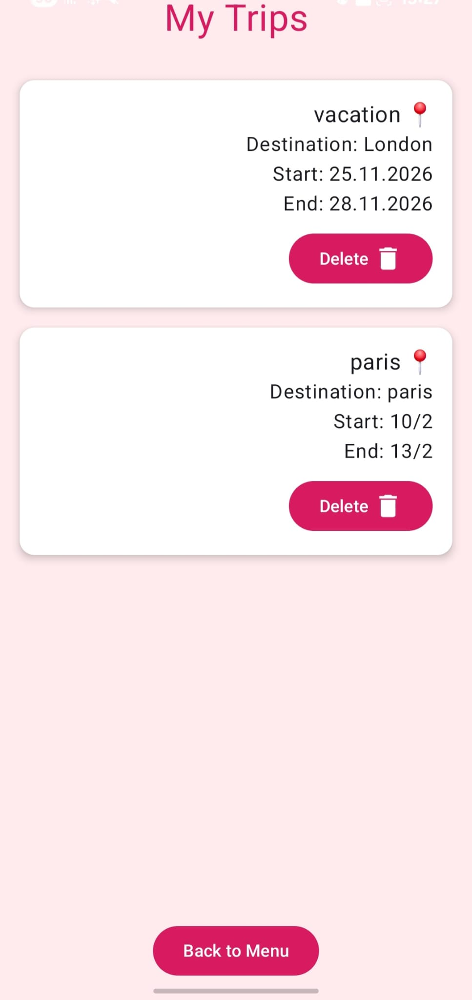
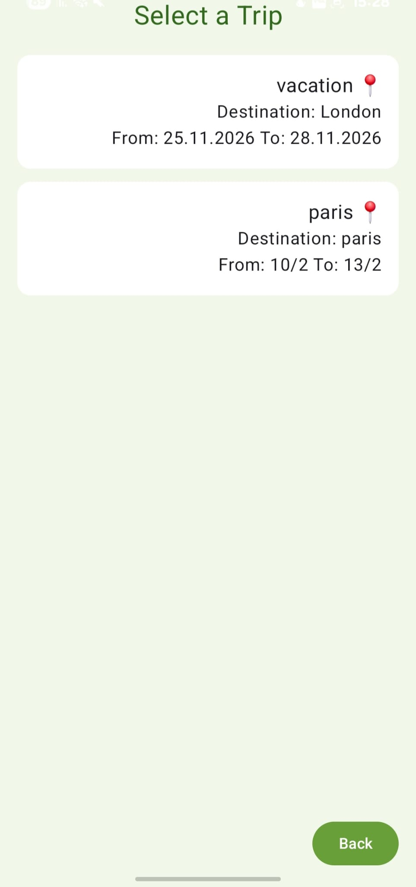

# 🌍 Wanderly – Trip Manager App

**Wanderly** is a personal trip management Android app built using Kotlin and Jetpack Compose. Each user can register, create private trips, upload documents and images, view trip details, and easily share trips with friends.

---

## ✨ Features

- 🔐 **User Authentication** – using Firebase Authentication
- 🧳 **Trip Management** – add, view, and delete trips (user-specific)
- 📝 **Trip Notes** – add and edit personal notes per trip
- 📎 **Upload Files & Photos** – store files per trip via Cloudinary
- 🗺️ **View Destination on Map** – using Google Maps SDK
- 🔗 **Share Trips with Friends** – share notes and files via Share Intent
- 👤 **User Profile with Avatar** – update profile photo via Cloudinary
- 🚫 **Per-User Data Isolation** – each user sees only their own trips & files

---

## 🛠️ Technologies Used

- 💻 Kotlin + Jetpack Compose
- ☁️ Firebase (Authentication & Firestore)
- ☁️ Cloudinary – for file/image uploads
- 🗺️ Google Maps SDK for Android
- 📤 Android Share Intent

---

## 🧪 How to Run

1. Open the project in **Android Studio**
2. Ensure your `google-services.json` file is correctly linked to Firebase
3. Add your **Cloudinary credentials** to `CloudinaryUploader.kt` if needed
4. Run on an emulator or a real Android device

---

## 📂 Main Screens

- `AuthScreen.kt` – Login / Register
- `MenuScreen.kt` – Main menu
- `AddTripScreen.kt` – Add a new trip
- `MyTripsScreen.kt` – View your trips
- `TripDetailsScreen.kt` – Trip details + sharing 
- `UploadDocumentScreen.kt` – Upload files/images
- `TripFilesScreen.kt` – View uploaded trip files
- `TripMapScreen.kt` – Show trip destination on map
- `ProfileScreen.kt` – View/update profile photo
- `SelectTripForUploadScreen.kt` – Choose a trip before uploading files

---

## 👩‍💻 Developed By

**Lusia Ruvinski**  
Final project for the Mobile App Development course (Kotlin-based).

---
## 📸 Screenshots

## 🎬 Demo Video

